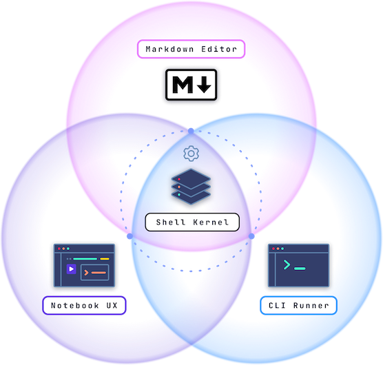

# What's Runme?

- Converts markdown files to interactive notebooks
- Understands shell environments and the cloud
- Runs multiple languages (Python, Bash, SQL, etc.)
- Universal task runner with editor, terminal, and notebook support

Borrows from Jupyter but accounts for developers and operators splitting time between the terminal, editor, browser tabs, and the cloud.



## It's just Markdown 💡

- Runme parsers and saved markdown files
- One person, everyone, or a few team members can use Runme
- Won't lock out anybody else


## Runs anywhere 🌍

Just like Chromium is powering Brave, Chrome, and Edge, Runme is built on the VS Code Platform (OSS). You don't have to use Microsoft's VS Code.

Pick your favorite flavor 🍦:

```ruby {"id":"01J9QNCBKDPS7670F73ZD46KVK","interactive":"true","terminalRows":"10"}
editors = ["VSCodium, Eclipse Theia", "WSL on Windows", "GitHub Codespaces", "Coder's code-server", "Google IDX, GCP Cloud Editor", "Gitpod", "The newly hyped AI-first Cursor"]

puts "\e[1mJust grab Runme from Open-VSX.org and you're good to go:\n\e[0m"

editors.each_with_index do |editor, index|
    offset = 31+index
    puts "\e[#{offset}m- #{editor}\e[0m"
    sleep 0.5
end
```

## Keep docs generic

Don't clutter your runnable docs with shell-scripting. Instead, we can configure the docs behavior at multiple levels:

1. Document-level Annotations in the Frontmatter
2. Block/Cell-level Annotations inside the Fenced Code Block
3. Specific VS Code settings
4. Repo/project config, aka `.runme.yaml` (coming soon)


## Environment variables & prompts

Runme detects top-level variable exports, e.g., `export MY_NAME=Enter your name`, and resolved them automatically if possible.

```sh {"id":"01J9PY2CP9YAAKAN4F3N48Z8T8","promptEnv":"yes"}
export MY_NAME="Max Mustermann"
```

- Runme maintains a managed env store per session
- It plays nicely with `.env` and friends to pre-load env vars
- Exported variables that remain valueless are prompted for user input

## Example of valueless export `MY_NAME`

```sh {"id":"01J9PX7MNWM2TFTHBHRA6RAN72","name":"my-name","promptEnv":"auto"}
echo "My name is ${MY_NAME}."
```

Unless resolved otherwise configured Runme will prompt for user input.

## Configure cell's prompt behavior

Easily change the mode using the `Configure` button in cell's bottom right. Values without quotes the value will become a prompt message.

```sh {"id":"01J9PYB8XKZKYKJFRVVPWY0HTJ","promptEnv":"auto"}
export MY_NAME=Enter your name here
```

At times, it makes to provide placeholder values and merely prompt for confirmation. Just wrap the prompt message in quotes.

```sh {"id":"01J9PYY3T6EM7YYWGKWTR8JE4G","promptEnv":"yes"}
export MY_NAME="Luna 🐕, my dog"
```

## Giving cells names

You can add well-known names to cells.

```sh {"id":"01J9PZT9EY6H3DS05KCQFHBE1B","name":"CONFIG_PATH"}
echo "${HOME}/.config/testing"
```

This is useful for:

- Easily exposing cells as tasks in the CLI
- Stash a cell's output in the ENV for later use
- Referencing cells from other cells

```sh {"id":"01J9PZS6SD8DNZTSKVY4BQVY83","name":"setup","terminalRows":"10"}
npm install
```

The output of the last recent run cell is always available as `$__`.

```sh {"id":"01J9Q00CMHKZ5V0F94R87YC1BX"}
echo -n $__
```

## Automatic media type detection

Non-text outputs are automatically detected and rendered as media if `interactive` mode is disabled.

```sql {"id":"01J9Q0SWVP2TXP6MT5MXWYRK2H","name":"QUERY"}
SELECT title, num_characters, timestamp, id, revision_id FROM
  `bigquery-public-data.samples.wikipedia`
WHERE num_characters < 67100
LIMIT 12;
```

```sh {"id":"01J9Q0TBXDFNMWWPDYPYY66FR3","interactive":"false"}
$ bq query --format json --use_legacy_sql=false $QUERY 2> /dev/null | jq .
```

## Into the Cloud ☁️

Now that we explored the basics, let's see how Runme can help us in [the cloud™️](1_aws.md).
